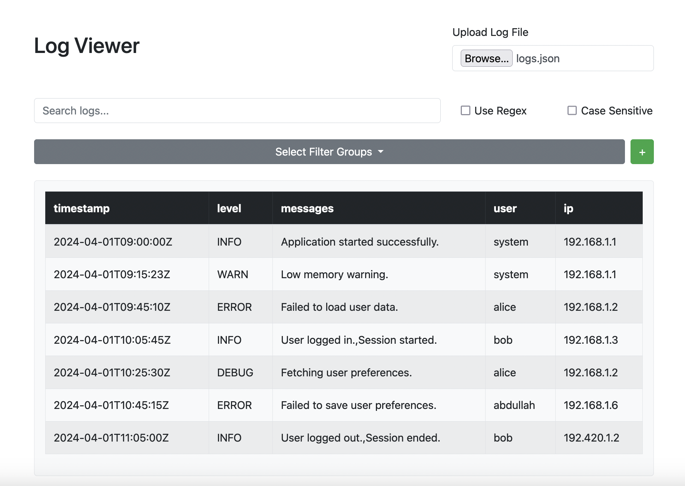
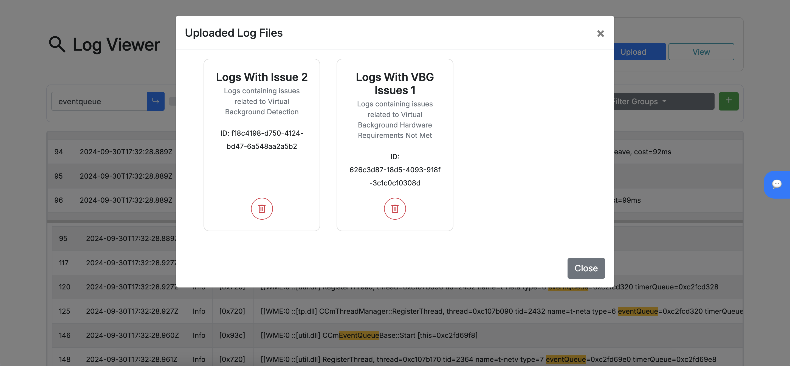
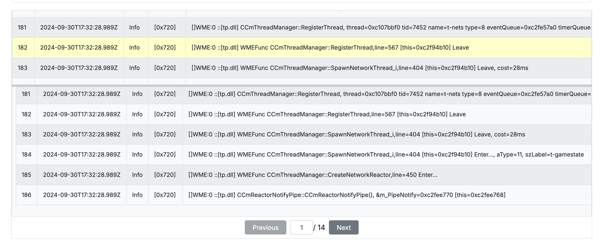
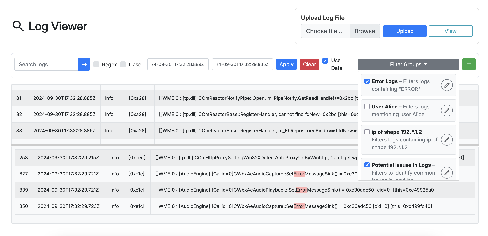
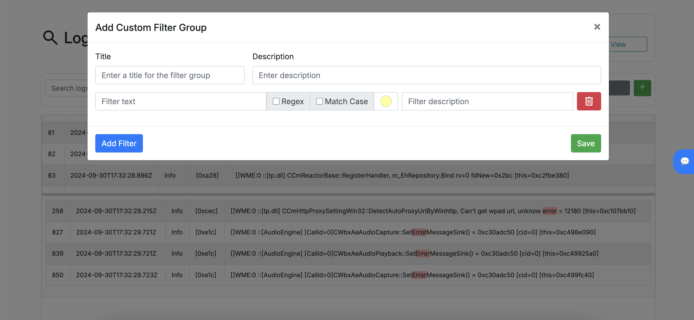
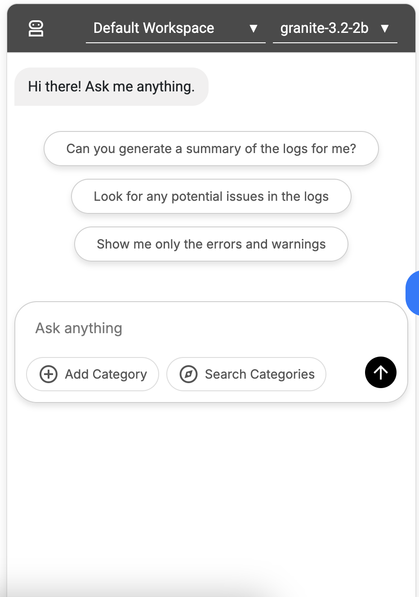
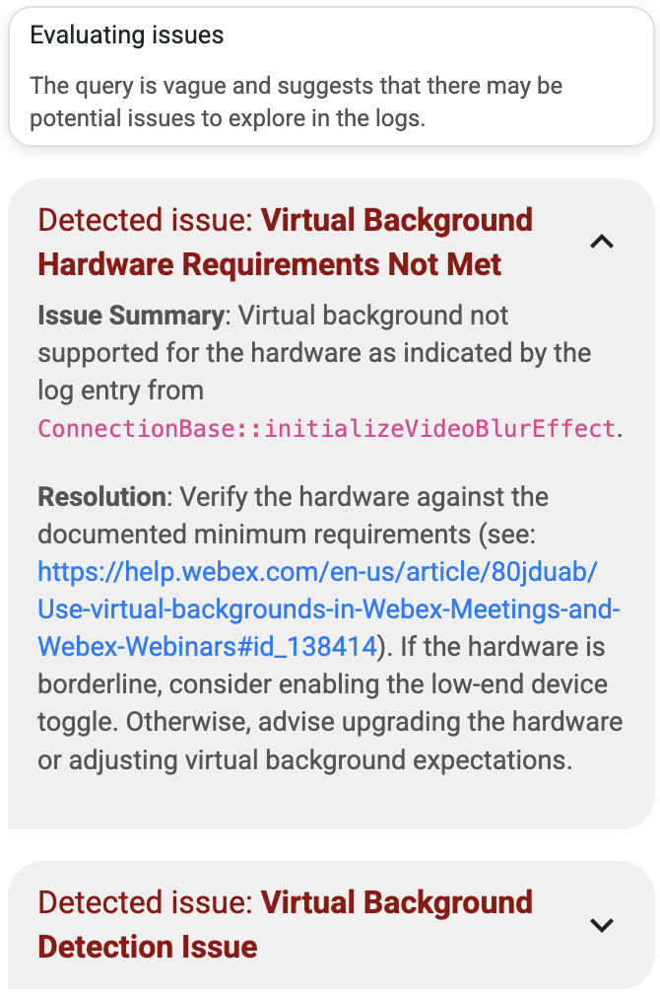
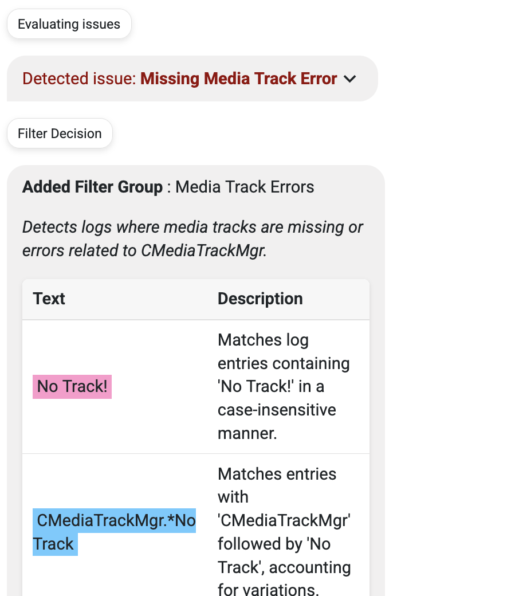
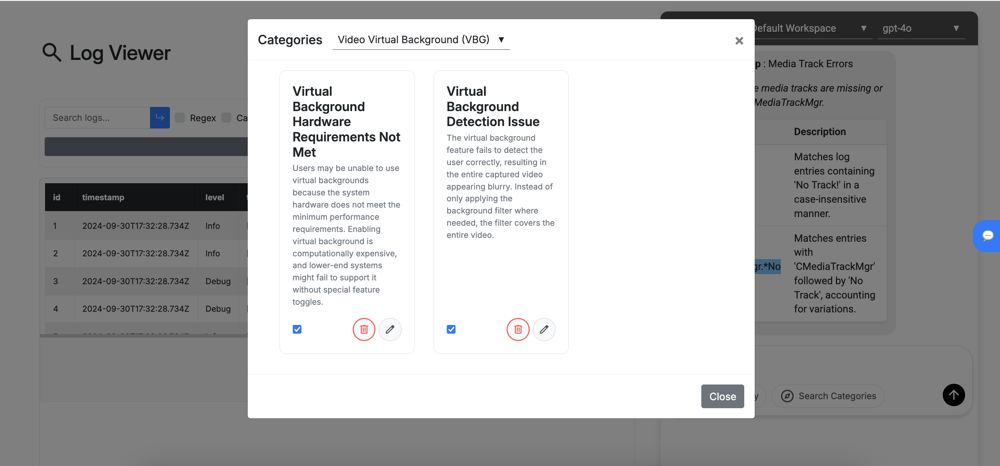
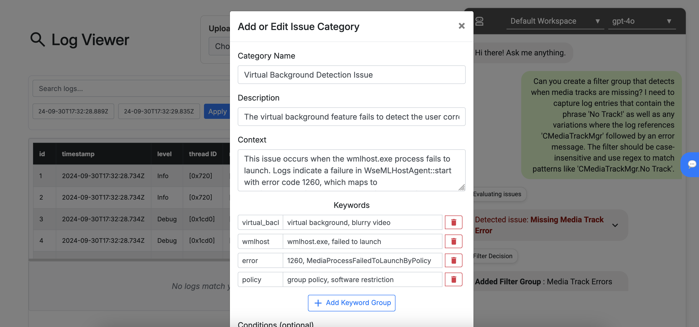

# Log Viewer Tool

A modern log viewer tool designed for Cisco engineers to quickly view, filter, and analyze log files. The tool features a responsive UI, customizable filters, intelligent summarization and issue detection powered by AI agents.

## Table of Contents

- [Overview](#overview)
- [Setup (Deployment Manual)](#setup)
  - [Client Setup](#client-setup)
  - [Server Setup](#server-setup)
    - [macOS Setup](#macos-setup)
    - [Windows Setup](#windows-setup)
  - [Database Setup](#database-setup)
  - [Environment Variables (.env)](#environment-variables-env)
  - [Enabling Offline AI Agent (macOS only)](#enabling-offline-ai-agent-macos-only)
- [Features (User Manual)](#features-user-manual)
  - [Uploading and Viewing Log Files](#uploading-and-viewing-log-files)
  - [Filtering Log Entries](#filtering-log-entries)
  - [AI Agent for Analysis](#ai-agent-for-analysis)
  - [Workspaces & Categories](#workspaces--categories)

## Overview

The Log Viewer Tool is built to help engineers quickly identify issues in large log files by:

- Uploading and displaying logs in a responsive table format.
- Providing real‑time filtering using basic text search, regex, and predefined or custom filter groups.
- Enabling an AI agent to analyze logs, generate summaries, detect known issues, and suggest filtering options.

## Setup

> **⚠️ Warning:**  
> The setup instructions provided below are currently tested only on macOS and Windows, as non of us had Linux machines to test on.

### Client Setup

First, you need to ensure you have the latest version of Node.js installed on your machine and can run npm commands.

1. Clone the repository.
2. Navigate to the client directory.
3. Install dependencies:

   ```bash
   npm install
   ```

4. Start the development server:

    ```bash
    npm run dev
    ```

You may also build the project and preview it in production mode:

```bash
npm run build
npm run preview
```

You can find test log files in the test-logs directory inside the root directory.

> **⚠️ Important Note:**
> Once you set up the server (backend) and it is fully running, you may need to refresh the client page to ensure we receive the available AI `models` from the server. This is because `models` are completely handled on the server side.

### Server Setup

> **⚠️ Important Note:**
> The server requires Python 3.12 or higher to run (we recommend the latest). Make sure you have the correct version installed and set as your environment's default Python interpreter.

The following are instructions to set up the backend. However, the frontend will fully work without the backend and will have all of the features except for the AI agent and the database. So if you only want to test the frontend, you can skip this section.

#### macOS Setup

First navigate to the server directory:

1. Create a Python virtual environment:

    ```bash
    python -m venv venv
    ```

2. Activate the virtual environment:

    ```bash
    source venv/bin/activate
    ```

3. Install required packages:

    ```bash
    pip install -r requirements.txt
    ```

4. Run the server:

    ```bash
    python main.py
    ```

#### Windows Setup

First navigate to the server directory:

> **Note:**
> Make sure your `py` command is set to Python 3.12 or higher.

1. Create a Python virtual environment:

    ```bash
    py -m venv venv
    ```

2. Activate the virtual environment:

    ```bash
    venv\Scripts\activate
    ```

3. Install required packages:

    ```bash
    pip install -r requirements.txt
    ```

4. Run the server:

    ```bash
    py main.py
    ```

### Database Setup

For efficient log storage and search capabilities, we use Elasticsearch:

1. Install Elasticsearch by following the instructions at [this article](https://www.elastic.co/guide/en/elasticsearch/reference/current/install-elasticsearch.html#elasticsearch-install-packages):
2. The set up can be quite lengthy, with setting up security being the longest part. For testing purposes, you can simply navigate to the Elasticsearch installation directory (e.g. elasticsearch-8.17.3) and then to config/elasticsearch.yml, and change the following config to be false. This will disable security for testing purposes:

    ```bash
    xpack.security.enabled: false
    ```

3. Start Elasticsearch (after navigating to the Elasticsearch installation directory):

  - Mac:

      ```bash
      ./bin/elasticsearch
      ```

  - Windows:

      ```bash
      .\bin\elasticsearch
      ```

4. Verify Elasticsearch is running:

  - Mac:

      ```bash
      curl -X GET "http://localhost:9200/?pretty"
      ```

  - Windows:

      ```bash
      curl.exe -X GET "http://localhost:9200/?pretty"
      ```

5. The expected output should look something like this:

    ```json
      {
        "name" : "Mujtabas-MacBook-Air-2.local",
        "cluster_name" : "elasticsearch",
        "cluster_uuid" : "da6pIJZERnOwSsUxFlwK7A",
        "version" : {
          "number" : "8.17.3",
          "build_flavor" : "default",
          "build_type" : "tar",
          "build_hash" : "a091390de485bd4b127884f7e565c0cad59b10d2",
          "build_date" : "2025-02-28T10:07:26.089129809Z",
          "build_snapshot" : false,
          "lucene_version" : "9.12.0",
          "minimum_wire_compatibility_version" : "7.17.0",
          "minimum_index_compatibility_version" : "7.0.0"
        },
        "tagline" : "You Know, for Search"
      }
    ```

These steps should set up Elasticsearch on your machine at `http://localhost:9200`.

If you run into issues, please follow the detailed instructions on the [Elasticsearch website](https://www.elastic.co/guide/en/elasticsearch/reference/current/setup.html).

### Environment Variables (.env)

Create a .env file in the server root directory with the following key (you may need to get your own OpenAI API key or come request one from us):

```bash
OPENAI_API_KEY=your_openai_api_key_here
```

### Enabling Offline AI Agent (macOS only)

> **⚠️ IMPORTANT WARNING:**
> We've deliberately disabled the AI agent by default since it causes compatibility issues with Windows machines. The following section will give you instructions on how to enable it. It has been tested on macOS and runs well on Metal. So feel free to enable it if you're on macOS, otherwise you can stick to the online agent.

You can also set up the AI agent to run on your own offline models. For this we use [llama.cpp](https://github.com/ggml-org/llama.cpp) for inference as it's one of the fastest ways to run compiled and quantized models (unfortunately it doesn't do well on compatibility, so if we had more time we might have ported to a more compatible framework).

To install llama.cpp's bindings for python, run the following commands:

```bash
CMAKE_ARGS="-DGGML_METAL=on"
pip install llama-cpp-python==0.3.4
```

Next, you need to download the .gguf file of the model. We recommend getting started with a lightweight model such as [granite3.2 instruct 2b](https://huggingface.co/ibm-research/granite-3.2-2b-instruct-GGUF/blob/main/granite-3.2-2b-instruct-Q6_K.gguf). Once you downloaded the .gguf file, create a models/granite folder and put the .gguf file in there. Note that you may put the .gguf file anywhere as long as you later reference the correct path in the main.py file.

Then, you need to go to the main.py file and uncomment the following import:

```python
# from model_client.offline_model import OfflineModelClient # Uncomment for offline model (disabled by default)
```

Further down, you'll find where `models` are defined which should look like this unedited:

```python
# Initialize models and client
models: dict[str, ModelClient] = {
    "gpt-4o": OpenAIModelClient(os.getenv("OPENAI_API_KEY") or "", "gpt-4o"),
    # Uncomment for offline model (disabled by default)
    # "granite-3.2-2b": OfflineModelClient(
    #     "models/granite/granite-3.2-2b-instruct-Q6_K.gguf",
    #     context_window=3072,
    # ),
}
```

You can now uncomment the offline model part for the model I recommended to start with, but feel free to put any other models (perhaps try 8b ones if your machine can handle it). Also feel fre to tweak the `context_window` parameter to your liking.

## Features (User Manual)



### Uploading and Viewing Log Files

- **Upload:**  
  Use the "Upload" button to load a JSON log file. The logs will be rendered in a table. You may also upload to a database. By pressing the "View" button next to the "Upload" button, you can view/delete logs uploaded there.


  
- **View:**  
  Logs are displayed in a double table responsive view that allows scrolling and pagination. The top table shows all the logs, while the bottom table displays the filtered logs. Clicking on a row in the bottom table will automatically highlight and scroll to the corresponding row in the top table. Also notice the gutter separating the two tables, which can be used to resize the tables based on how much space the user would like to give to either table.



### Filtering Log Entries

#### Basic Search Bar

- **Efficient Filtering:**  
  Filter log entries by typing in the search bar. Enable/disable case sensitivity and regular expressions for advanced filtering.

#### Predefined Filters

- **Quick Isolation:**  
  Choose from a set of predefined filter groups to quickly isolate log entries. Multiple groups can be applied simultaneously.



#### Custom Filters

- **Create and Save:**  
  Click the "+" button to create custom filter groups. These filters can be saved for later use and appear in the dropdown.



### AI Agent for Analysis

The integrated AI agent assists in log analysis by generating summaries, detecting known issues, and suggesting filters.



#### Summary Generation

- **Automated Summaries:**  
  The agent analyzes log statistics and generates a concise summary to highlight trends and anomalies.

#### Known Issues Detection

- **Contextual Analysis:**  
  The agent compares log data against known issues and flags potential problems, providing an explanation and suggested resolution. It does this by utilizing keywords and regex patterns as well as semantic search to
  find relevant logs and then see if they match known issues.



#### Filter Recommendation

- **Natural Language Conversion:**  
  The agent converts natural language queries into structured filter groups (with keywords or regex) to refine log output.




### Workspaces & Categories

The agent needs context to provide accurate recommendations. Workspaces and categories help organize filters and known issues for better management.

- **Workspace Management:**  
  Organize filters and known issues into workspaces for better management.
  


- **Category Modal:**  
  View, edit, and delete filter categories in a modern, responsive modal interface.


