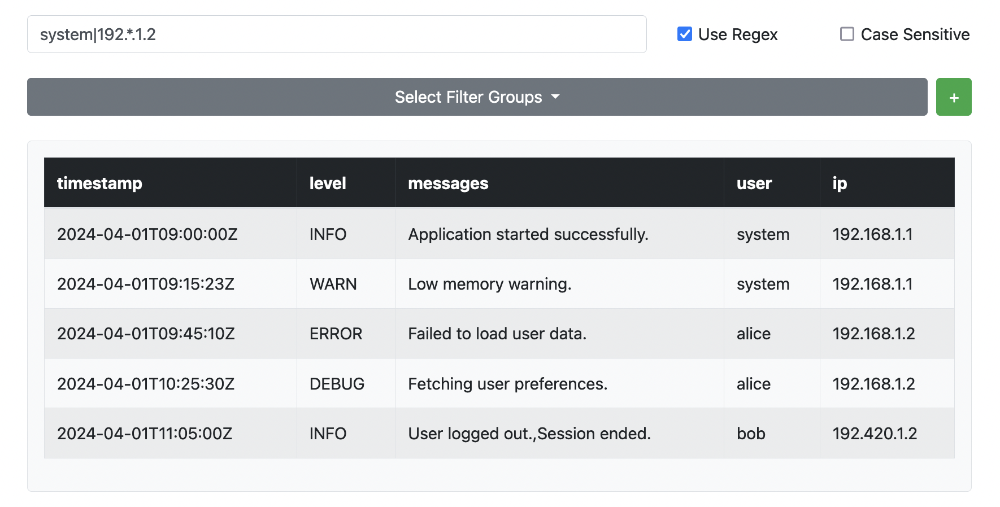
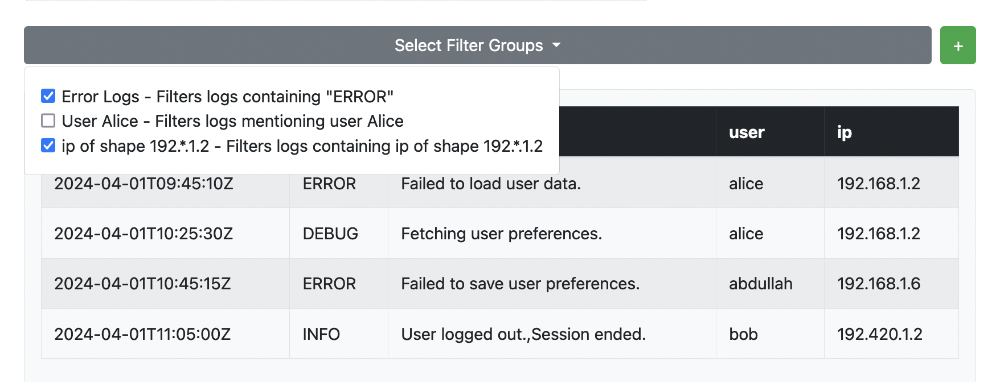

# Log Viewer

A simple log viewer for viewing and filtering log files.

## How to use

1. Clone the repository
2. Run `npm install`
3. Run `npm run dev`

## Features

### Uploading and viewing log files

You can upload a log file by clicking the "Upload" button. The log file will be displayed in the viewer as a table.

### Filtering log entries

Note: everything is responsive and updates as you type.

#### Basic search bar

You can filter log entries by simply typing in the search bar. You can enable/disable case sensitivity and regular expressions.

#### Predefined filters

You may also choose from a set of predefined filters, even stacking them together (in an OR fashion).

#### Custom Made filters

You can also create your own filters by clicking the "+" button next to the "select filter groups" dropdown. You can then save your filter group for later use and it will show up in the dropdown.

